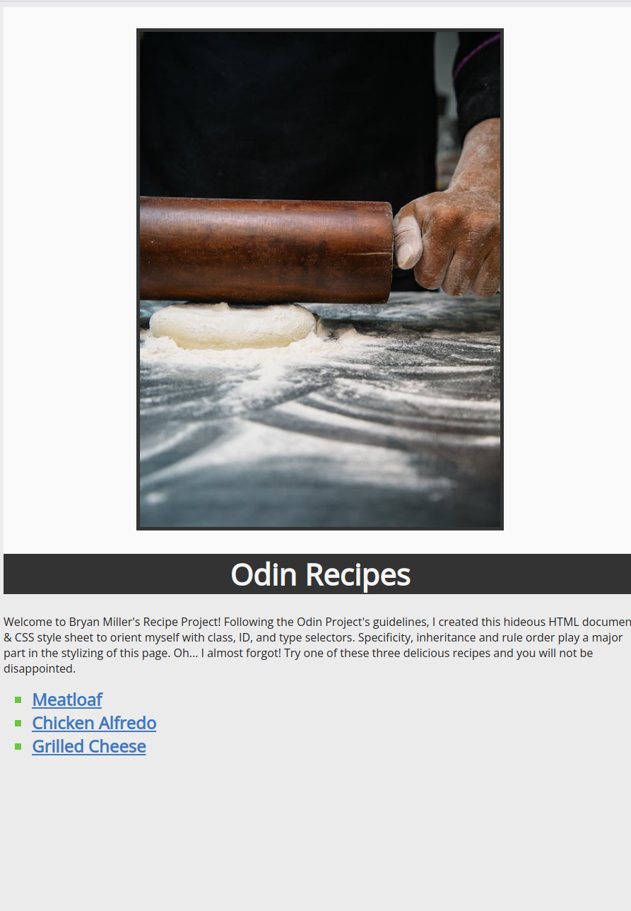
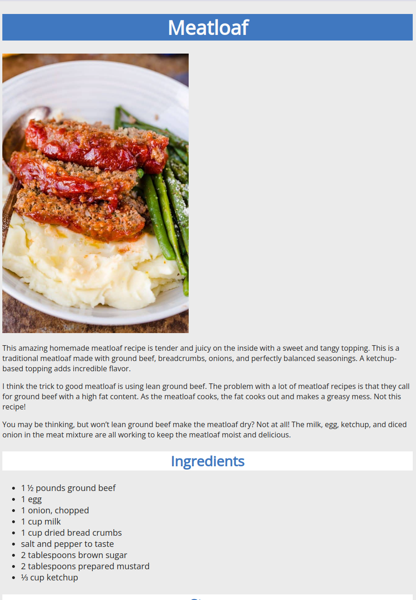

# Odin Recipes Project

- [Live Demo](https://bmilcs.github.io/odin-recipes/)
- [My Odin Project Progress](https://github.com/bmilcs/op)

Welcome to Bryan Miller's Recipes Project, the [first assignment](https://www.theodinproject.com/lessons/foundations-recipes) within the Odin Project curriculum. The goal of this repo is to re-familiarize myself with the fundamentals of HTML and CSS. A noninclusive list of topics covered are as follows:

- HTML boilerplate & common elements
- External CSS
  - ID, Class, and Type Selectors
  - Inheritance & Specificity
  - Grouping & Chaining Selectors
  - Descendant Combinator(s)
  - Rule Order (Cascade)
- Git Fundamentals
  - Atomic commits

# Screenshots

## Main Page



## Recipe Page



## Deployment

```sh
git clone git@github.com:bmilcs/odin-recipes.git
```
